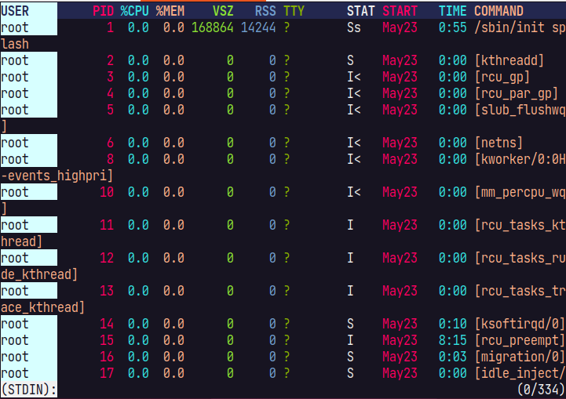
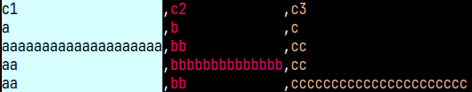
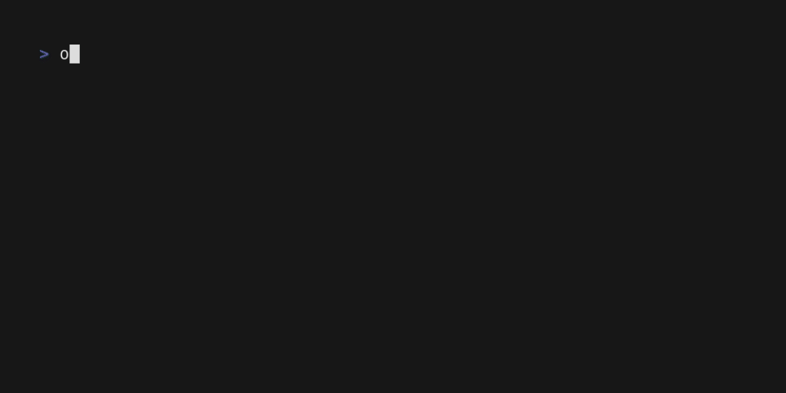
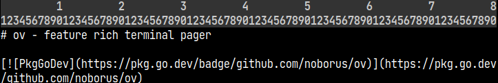
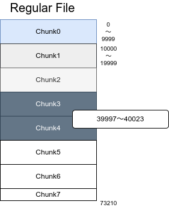
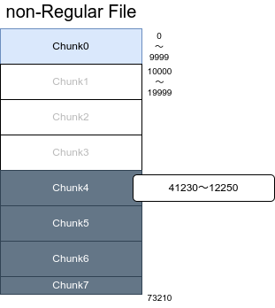

# ov - feature rich terminal pager

[](https://pkg.go.dev/github.com/noborus/ov)
[](https://github.com/noborus/ov/actions)
[](https://goreportcard.com/report/github.com/noborus/ov)

ov is a terminal pager.


<!-- vscode-markdown-toc -->
* 1. [Feature](#feature)
  * 1.1. [Not supported](#not-supported)
* 2. [Install](#install)
  * 2.1. [deb package](#deb-package)
  * 2.2. [rpm package](#rpm-package)
  * 2.3. [MacPorts (macOS)](#macports-(macos))
  * 2.4. [Homebrew(macOS or Linux)](#homebrew(macos-or-linux))
  * 2.5. [winget(windows)](#winget(windows))
  * 2.6. [pkg (FreeBSD)](#pkg-(freebsd))
  * 2.7. [Arch Linux](#arch-linux)
  * 2.8. [nix (nixOS, Linux, or macOS)](#nix-(nixos,-linux,-or-macos))
  * 2.9. [Binary](#binary)
  * 2.10. [go install](#go-install)
  * 2.11. [Build from source](#build-from-source)
  * 2.12. [Completion](#completion)
    * 2.12.1. [bash](#bash)
    * 2.12.2. [zsh](#zsh)
    * 2.12.3. [fish](#fish)
    * 2.12.4. [powershell](#powershell)
* 3. [Basic usage](#basic-usage)
* 4. [Usage](#usage)
  * 4.1. [Config](#config)
  * 4.2. [Header](#header)
    * 4.2.1. [Skip](#skip)
  * 4.3. [Vertical Header](#vertical-header)
  * 4.4. [Column mode](#column-mode)
  * 4.5. [Header Column](#header-column)
  * 4.6. [Column rainbow mode](#column-rainbow-mode)
  * 4.7. [Column width](#column-width)
  * 4.8. [Wrap/NoWrap](#wrap/nowrap)
  * 4.9. [Alternate-Rows](#alternate-rows)
  * 4.10. [Section](#section)
    * 4.10.1. [section example](#section-example)
    * 4.10.2. [hide other sections](#hide-other-sections)
  * 4.11. [Multiple files](#multiple-files)
  * 4.12. [Follow mode](#follow-mode)
    * 4.12.1. [Follow name](#follow-name)
    * 4.12.2. [Follow all mode](#follow-all-mode)
    * 4.12.3. [Follow section mode](#follow-section-mode)
  * 4.13. [Exec mode](#exec-mode)
  * 4.14. [Search](#search)
    * 4.14.1. [Pattern](#pattern)
    * 4.14.2. [Filter](#filter)
  * 4.15. [Caption](#caption)
  * 4.16. [Mark](#mark)
  * 4.17. [Watch](#watch)
  * 4.18. [Mouse support](#mouse-support)
  * 4.19. [Multi color highlight](#multi-color-highlight)
  * 4.20. [Plain](#plain)
  * 4.21. [Converter](#converter)
  * 4.22. [Align](#align)
    * 4.22.1. [Shrink](#shrink)
  * 4.23. [Jump target](#jump-target)
  * 4.24. [View mode](#view-mode)
  * 4.25. [Output on exit](#output-on-exit)
  * 4.26. [Quit if one screen](#quit-if-one-screen)
  * 4.27. [Suspend](#suspend)
  * 4.28. [Save](#save)
  * 4.29. [Ruler](#ruler)
  * 4.30. [Redirect Output](#redirect-output)
* 5. [How to reduce memory usage](#how-to-reduce-memory-usage)
  * 5.1. [Regular file (seekable)](#regular-file-(seekable))
  * 5.2. [Other files, pipes(Non-seekable)](#other-files,-pipes(non-seekable))
* 6. [Command option](#command-option)
* 7. [Key bindings](#key-bindings)
* 8. [Customize](#customize)
  * 8.1. [Style customization](#style-customization)
    * 8.1.1. [UnderlineStyle](#underlinestyle)
  * 8.2. [Customizing the bottom status line](#customizing-the-bottom-status-line)
  * 8.3. [Key binding customization](#key-binding-customization)
* 9. [VS](#vs)
* 10. [Work together](#work-together)
* 11. [Contributing](#contributing)

<!-- vscode-markdown-toc-config
	numbering=true
	autoSave=true
	/vscode-markdown-toc-config -->
<!-- /vscode-markdown-toc -->

##  1. <a name='feature'></a>Feature

* Quickly opens files larger than memory.
* Supports fixed header lines and columns.
* Optimized for tabular text with column mode and customizable column colors.
* Fully customizable shortcut keys and styles.
* Follow mode for real-time updates (like `tail -f` / `tail -F`).
* Exec mode to display command output dynamically.
* Watch mode to monitor file changes periodically.
* Advanced search: incremental, regex, and filter functions.
* Multi-color highlighting for multiple words.
* Supports Unicode and East Asian Width characters.
* Handles compressed files (gzip, bzip2, zstd, lz4, xz).

###  1.1. <a name='not-supported'></a>Not supported

* Does not support syntax highlighting for file types (source code, markdown, etc.)

##  2. <a name='install'></a>Install

###  2.1. <a name='deb-package'></a>deb package

You can download the package from [releases](https://github.com/noborus/ov/releases).

```console
curl -L -O https://github.com/noborus/ov/releases/download/vx.x.x/ov_x.x.x-1_amd64.deb
sudo dpkg -i ov_x.x.x-1_amd64.deb
```

###  2.2. <a name='rpm-package'></a>rpm package

You can download the package from [releases](https://github.com/noborus/ov/releases).

```console
sudo rpm -ivh https://github.com/noborus/ov/releases/download/vx.x.x/ov_x.x.x-1_amd64.rpm
```

###  2.3. <a name='macports-(macos)'></a>MacPorts (macOS)

```console
sudo port install ov
```

###  2.4. <a name='homebrew(macos-or-linux)'></a>Homebrew(macOS or Linux)

```console
brew install noborus/tap/ov
```

###  2.5. <a name='winget(windows)'></a>winget(windows)

```console
winget install -e --id noborus.ov
```

###  2.6. <a name='pkg-(freebsd)'></a>pkg (FreeBSD)

```console
pkg install ov
```

###  2.7. <a name='arch-linux'></a>Arch Linux

You can install ov using an [AUR helper](https://wiki.archlinux.org/title/AUR_helpers).

Choose an AUR package:

* [https://aur.archlinux.org/packages/ov](https://aur.archlinux.org/packages/ov) (build and install from latest stable source)
* [https://aur.archlinux.org/packages/ov-bin](https://aur.archlinux.org/packages/ov-bin) (install pre-compiled binary)
* [https://aur.archlinux.org/packages/ov-git](https://aur.archlinux.org/packages/ov-git) (build and install from latest git commit)

###  2.8. <a name='nix-(nixos,-linux,-or-macos)'></a>nix (nixOS, Linux, or macOS)

ov is available as a nix package. You can install it with

```console
nix profile install nixpkgs#ov
```

if you use flakes, or using nix-env otherwise:

```console
nix-env -iA nixpkgs.ov
```

###  2.9. <a name='binary'></a>Binary

You can download the binary from [releases](https://github.com/noborus/ov/releases).

```console
curl -L -O https://github.com/noborus/ov/releases/download/vx.x.x/ov_x.x.x_linux_amd64.zip
unzip ov_x.x.x_linux_amd64.zip
sudo install ov /usr/local/bin
```

###  2.10. <a name='go-install'></a>go install

It will be installed in $GOPATH/bin by the following command.

```console
go install github.com/noborus/ov@latest
```

Or to install the latest commit from master:

```console
go install github.com/noborus/ov@master
```

###  2.11. <a name='build-from-source'></a>Build from source

First of all, clone this repo with either `git clone` or `gh repo clone`, then `cd` to the directory, for example:

```console
git clone https://github.com/noborus/ov.git
cd ov
```

Next, to install to $GOPATH/bin, run the make install command.

```console
make install
```

Or, install it in a PATH location for other users to use
(For example, in /usr/local/bin).

```console
make
sudo install ov /usr/local/bin
```

###  2.12. <a name='completion'></a>Completion

You can generate completion scripts for bash, zsh, fish, and powershell.

####  2.12.1. <a name='bash'></a>bash

```console
ov --completion bash > /etc/bash_completion.d/ov
```

####  2.12.2. <a name='zsh'></a>zsh

```console
ov --completion zsh > /usr/share/zsh/site-functions/_ov
```

For zinit users.

```console
zinit load 'https://github.com/noborus/ov/blob/master/ov.plugin.zsh'
```

####  2.12.3. <a name='fish'></a>fish

```console
ov --completion fish > ~/.config/fish/completions/ov.fish
```

####  2.12.4. <a name='powershell'></a>powershell

```console
ov --completion powershell completion powershell | Out-String | Invoke-Expression
```

##  3. <a name='basic-usage'></a>Basic usage

ov supports open file name or standard input.

```console
ov filename
```

```console
cat filename|ov
```

Used by other commands by setting the environment variable **PAGER**.

```console
export PAGER=ov
```

##  4. <a name='usage'></a>Usage

See the [ov site](https://noborus.github.io/ov/) for more use cases and examples.

> [!NOTE]
> (default key `key`) indicates the key that can be specified even after starting the same function as the command line option.

###  4.1. <a name='config'></a>Config

You can set style and key bindings in the configuration file.

ov will look for a configuration file in the following paths in descending order:

```filepath
$XDG_CONFIG_HOME/ov/config.yaml
$HOME/.config/ov/config.yaml
$HOME/.ov.yaml
```

On Windows:

```filepath
%USERPROFILE%/.config/ov/config.yaml
%USERPROFILE%/.ov.yaml
```

Create a `config.yaml` file in one of the above directories. If the file is in the user home directory, it should be named `.ov.yaml`.

Please refer to the sample [ov.yaml](https://raw.githubusercontent.com/noborus/ov/master/ov.yaml) configuration file.

> [!NOTE]
> If you like `less` key bindings, copy  [ov-less.yaml](https://raw.githubusercontent.com/noborus/ov/master/ov-less.yaml) and use it.

###  4.2. <a name='header'></a>Header

The `--header` (`-H`) (default key `H`) option fixedly displays the specified number of lines.

```console
ov --header 1 README.md
```

[Related styling](#style-customization): `Header` and `HeaderBorder`.

####  4.2.1. <a name='skip'></a>Skip

When used with the `--skip-lines` (default key `ctrl+s`) option, it hides the number of lines specified by skip and then displays the header.

```console
ov --skip-lines 1 --header 1 README.md
```

###  4.3. <a name='vertical-header'></a>Vertical Header

*Added in v0.39.0*

The `--vertical-header` (`-y`) (defakult key `y`) option fixedly displays the specified number of chars.

```console
ov --vertial-header=4 README.md
```

If you want to specify by column instead of character, see [Header Column](#header-column).

[Related styling](#style-customization): `VerticalHeader` and `VerticalHeaderBorder`.

###  4.4. <a name='column-mode'></a>Column mode

Specify the delimiter with `--column-delimiter`(default key is `d`) and set it to `--column-mode`(default key is `c`) to highlight the column.

```console
ov --column-delimiter "," --column-mode test.csv
```

Regular expressions can be used for the `--column-delimiter`.
Enclose in '/' when using regular expressions.

```console
ps aux | ov -H1 --column-delimiter "/\s+/" --column-rainbow --column-mode
```

[Related styling](#style-customization): `ColumnHighlight`,`ColumnRainbow`.

###  4.5. <a name='header-column'></a>Header Column

*Added in v0.39.0*

The `--header-column` (`-Y`) (default key is `Y`) option fixedly displays the specified number of columns when `column-mode` is enabled.

```console
ov --column-mode --column-delimiter="," --header-column=2 test.csv
```

When in column-mode, pressing `F` will switch to fixed display for the selected columns up to that point.

[Related styling](#style-customization): `VerticalHeader` and `VerticalHeaderBorder`.

###  4.6. <a name='column-rainbow-mode'></a>Column rainbow mode

You can also color each column individually in column mode.
Specify `--column-rainbow`(default key is `ctrl+r`) in addition to the `--column-mode` option.

Color customization is possible. Please specify 7 or more colors in `config.yaml`.

```yaml
Style:
  ColumnRainbow:
    - Foreground: "white"
    - Foreground: "aqua"
    - Foreground: "lightsalmon"
    - Foreground: "lime"
    - Foreground: "blue"
    - Foreground: "yellowgreen"
    - Foreground: "red"
```

Style specifications other than `Foreground` can also be specified.

```yaml
Style:
  ColumnRainbow:
    - Foreground: "white"
      Background: "red"
    - Foreground: "aqua"
      Underline: true
    - Foreground: "#ff7f00"
      Background: "blue"
      Bold: true
    - Foreground: "lime"
      Italic: true
    - Foreground: "blue"
      Dim: true
    - Foreground: "yellowgreen"
    - Foreground: "red"
```

[Related styling](#style-customization): `ColumnRainbow`.

###  4.7. <a name='column-width'></a>Column width

The `--column-width` option is designed for **command output with irregular spaces**, such as `ps aux`, `df`, etc.  (default key `alt+o`).
It automatically **detects and separates columns** without needing a specific delimiter.

```console
ps aux|ov -H1 --column-width --column-rainbow
```



This column-width feature is implemented using [guesswidth](https://github.com/noborus/guesswidth).

###  4.8. <a name='wrap/nowrap'></a>Wrap/NoWrap

Supports switching between wrapping and not wrapping lines.

The option is `--wrap`, specify `--wrap=false` (default key `w`, `W`) if you do not want to wrap.

###  4.9. <a name='alternate-rows'></a>Alternate-Rows

Alternate row styles with the `--alternate-rows`(`-C`) (default key `C`) option
The style can be set with [Style customization](#style-customization).

```console
ov --alternate-rows test.csv
```

[Related styling](#style-customization): `Alternate`.

###  4.10. <a name='section'></a>Section

You can specify a section delimiter using `--section-delimiter` (default key `alt+d`).

This allows you to move between sections (default keys `space` and `^`).

The specified line will also be treated as a **section header** and will remain fixed at the specified position until the next section appears at the specified position.

The start of the section can be adjusted with `--section-start`(default key `ctrl+F3`, `alt+s`).


The `--section-delimiter` is written in a regular expression (for example: "^#").
(Line breaks are not included in matching lines).

For example, if you specify "^diff" for a diff that contains multiple files,
you can move the diff for each file.

The number of lines in section-header can be changed.
You can specify the number of lines using the `--section-header-num` option or key input(default key `F7`).

####  4.10.1. <a name='section-example'></a>section example

This is an example of using the `git` pager.

```gitconfig
[pager]
	diff = "ov -F --section-delimiter '^diff'"
	log = "ov -F --section-delimiter '^commit' --section-header-num 3"
```

[Related styling](#style-customization): `SectionLine`.

####  4.10.2. <a name='hide-other-sections'></a>hide other sections

If you specify `--hide-other-section`(default key `alt+-`), only the current section is displayed.

```console
ov --section-delimiter "^#" --hide-other-section README.md
```

This is just hidden, so it will be displayed when you move to the next section.

###  4.11. <a name='multiple-files'></a>Multiple files

`ov` can also open multiple files.

```console
ov file1 file2
```

Multiple files are each opened as a document and can be navigated using the Next Document `]` key (default), Previous Document `[` key (default).

Related Styling: [Customizing the bottom status line](#customizing-the-bottom-status-line).

###  4.12. <a name='follow-mode'></a>Follow mode

`--follow`(`-f`)(default key `ctrl+f`) prints appended data and moves to the bottom line (like `tail -f`).

```console
ov --follow-mode /var/log/syslog
```

```console
(while :; do echo random-$RANDOM; sleep 0.1; done;)|./ov  --follow-mode
```

> [!NOTE]
> Due to issue[issue #643](https://github.com/noborus/ov/issues/643), follow-mode does not work for files in the /tmp folder on macOS.

####  4.12.1. <a name='follow-name'></a>Follow name

You can specify the file name to follow with `--follow-name`(like `tail -F`).
Monitor file names instead of file descriptors.

```console
ov --follow-name /var/log/nginx/access.log
```

####  4.12.2. <a name='follow-all-mode'></a>Follow all mode

`--follow-all`(`-A`)(default key `ctrl+a`) is the same as follow mode, it switches to the last updated file if there are multiple files.

```console
ov --follow-all /var/log/nginx/access.log /var/log/nginx/error.log
```

####  4.12.3. <a name='follow-section-mode'></a>Follow section mode

Use the `--follow-section`(default key `F2`) option to follow by section.
Follow mode is line-by-line, while follow section mode is section-by-section.
Follow section mode displays the bottom section.
The following example is displayed from the header (#) at the bottom.

```console
ov --section-delimiter "^#" --follow-section README.md
```

> [!NOTE]
> [Watch](#watch) mode is a mode in which `--follow-section` and `--section-delimiter "^\f"` are automatically set.

###  4.13. <a name='exec-mode'></a>Exec mode

Exec mode captures the output of a command and displays it in `ov`.
It works similarly to `watch`, but with advanced paging features.

Use the `--exec` (`-e`) option to run the command and display stdout/stderr separately.
Arguments after (`--`) are interpreted as command arguments.

```console
ov --exec -- ls -l
```

Shows the stderr screen as soon as an error occurs, when used with `--follow-all`.

```console
ov --follow-all --exec -- make
```

In exec mode (other than Windows) the output is opened by opening a `pty`.
Therefore, the command is likely to be printed in color.

```console
ov --exec -- eza -l
```

It is useful to use the `--notify-eof` option together with exec mode to get notified when the command finishes,
especially for long-running commands like make.

```console
ov --notify-eof --exec -- make
```

###  4.14. <a name='search'></a>Search

Search by forward search `/` key(default) or the backward search `?` key(default).
Search can be toggled between incremental search, regular expression search, and case sensitivity.
Displayed when the following are enabled in the search input prompt:

|         Function          | display | (Default)key |     command option     |    config file     |
|---------------------------|---------|--------------|------------------------|--------------------|
| Incremental search        | (I)     | alt+i        | --incremental          | Incsearch          |
| Regular expression search | (R)     | alt+r        | --regexp-search        | RegexpSearch       |
| Case-sensitive            | (Aa)    | alt+c        | -i, --case-sensitive   | CaseSensitive      |
| Smart case-sensitive      | (S)     | alt+s        | --smart-case-sensitive | SmartCaseSensitive |

Specify true/false in config file.

```config.yaml
CaseSensitive: false
RegexpSearch: false
Incsearch: true
SmartCaseSensitive: true
```

[Related styling](#style-customization): `SearchHighlight`

####  4.14.1. <a name='pattern'></a>Pattern

The pattern option allows you to specify a search at startup.

```console
ov --pattern install README.md
```

####  4.14.2. <a name='filter'></a>Filter

Filter input is possible using the `&` key(default).
The filter input creates a new document only for the lines that match the filter.

Move next document `]` and previous document `[` key(default) allow you to move between the filter document and the original document.

The `K`(`shift+k`) key (default) closes all documents created by the filter.

You can also specify a filter using the command line option `--filter`.

```console
ov --filter "install" README.md
```

The filter is a regular expression.

```console
ov --filter "^#" README.md
```

Also, specify the non-matching line instead of the non-matching line.

If you press `!` on `&` while inputting a filter, non-matching lines will be targeted.

The command line option for this can be specified with `--non-match-filter`.

```console
ov --non-match-filter info /var/log/syslog
```

If you specify both a `filter` option and the [Quit if one screen](#quit-if-one-screen) option,
the command will display the results of the filter and then quit if the results fit on one screen.

```console
$ ps aux|ov -H1 --filter postgres --quit-if-one-screen
USER         PID %CPU %MEM    VSZ   RSS TTY      STAT START   TIME COMMAND
postgres    1589  0.0  0.0 221992 29952 ?        Ss   Jul24   0:02 /usr/lib/postgresql/14/bin/postgres -D /var/lib/postgresql/14/main -c config_file=/etc/postgresql/14/main/postgresql.conf
postgres    1624  0.0  0.0 222104  9544 ?        Ss   Jul24   0:00 postgres: 14/main: checkpointer 
postgres    1626  0.0  0.0 221992  8392 ?        Ss   Jul24   0:00 postgres: 14/main: background writer 
postgres    1627  0.0  0.0 221992 11464 ?        Ss   Jul24   0:00 postgres: 14/main: walwriter 
postgres    1628  0.0  0.0 222560  9928 ?        Ss   Jul24   0:01 postgres: 14/main: autovacuum launcher 
postgres    1629  0.0  0.0  76728  7112 ?        Ss   Jul24   0:01 postgres: 14/main: stats collector 
postgres    1631  0.0  0.0 222420  8904 ?        Ss   Jul24   0:00 postgres: 14/main: logical replication launcher 
noborus   193766  0.0  0.0 1603756 7552 pts/0    Rl+  10:37   0:00 ov -H1 -F --filter postgres
```

###  4.15. <a name='caption'></a>Caption

You can specify a caption instead of the file name in status line to display it.

```console
ls -alF|ov --caption "ls -alF"
```

It can also be specified as an environment variable.

```console
export OV_CAPTION="ls -alF"
ls -alF|ov
```

###  4.16. <a name='mark'></a>Mark

Mark the display position with the `m` key(default).
The mark is decorated with `MarkLine` and `MarkStyleWidth`.

Marks can be erased individually with the `M` key(default).
It is also possible to delete all marks with the `ctrl + delete` key(default).

Use the `>`next and `<`previous (default) key to move to the marked position.

[Related styling](#style-customization): `MarkLine`.

###  4.17. <a name='watch'></a>Watch

`ov` has a watch mode that reads the file every N seconds and adds it to the end.
When you reach EOF, add '\f' instead.
Use the `--watch`(`-T`) option.
Go further to the last section.
The default is'section-delimiter', so the last loaded content is displayed.

for example.

```console
ov --watch 1 /proc/meminfo
```

###  4.18. <a name='mouse-support'></a>Mouse support

The ov makes the mouse support its control.
This can be disabled with the option `--disable-mouse`(default key `ctrl+F3`, `ctrl+alt+r`).

If mouse support is enabled, tabs and line breaks will be interpreted correctly when copying.

Copying to the clipboard uses [atotto/clipboard](https://github.com/atotto/clipboard).
For this reason, the 'xclip' or 'xsel' command is required in Linux/Unix environments.

Selecting the range with the mouse and then left-clicking will copy it to the clipboard.

Pasting in ov is done with the middle button.
In other applications, it is pasted from the clipboard (often by pressing the right-click).

Also, if mouse support is enabled, horizontal scrolling is possible with `shift+wheel`.

###  4.19. <a name='multi-color-highlight'></a>Multi color highlight

This feature styles multiple words individually.
`.`key(default) enters multi-word input mode.
Enter multiple words (regular expressions) separated by spaces.

For example, `error info warn debug` will color errors red, info cyan, warn yellow, and debug magenta.

It can also be specified with the command line option `--multi-color`(`-M`)(default key `.`).
For command line options, pass them separated by ,(comma).

For example:

```console
ov --multi-color "ERROR,WARN,INFO,DEBUG,not,^.{24}" access.log
```


Color customization is possible. Please specify 7 or more colors in config.yaml.

```yaml
Style:
  MultiColorHighlight:
    - Foreground: "red"
      Reverse: true
    - Foreground: "aqua"
      Underline: true
    - Foreground: "yellow"
      Background: "blue"
    - Foreground: "fuchsia"
    - Foreground: "lime"
    - Foreground: "blue"
    - Foreground: "#c0c0c0"
```

[Related styling](#style-customization): `MultiColorHighlight`.

###  4.20. <a name='plain'></a>Plain

Supports disable decoration ANSI escape sequences.
The option is `--plain` (or `-p`) (default key `ctrl+e`).

###  4.21. <a name='converter'></a>Converter

Converter selects the engine to convert and display the text.
Usually, the escape sequence is interpreted and displayed by `es` (default).
`raw` displays as it is without interpreting the escape sequence.

You can specify the `--converter` option with `[es|raw|align]`,
and you can also specify the `--raw`, `--align`([Align](#align)) option as a shortcut option.

> [!NOTE]
> `raw` also displays the character string of the escape sequence,
> but be aware that [Plain](#plain) hides the decoration after interpreting the escape sequence.

###  4.22. <a name='align'></a>Align

The `--align` option adjusts column widths to improve readability for **irregularly formatted tabular data**, such as CSV files with misaligned columns.

Example:

```console
ov --column-mode --align test.csv
```

```csv
c1,c2,c3
a,b,c
aaaaaaaaaaaaaaaaaaaa,bb,cc
aa,bbbbbbbbbbbbbb,cc
aa,bb,cccccccccccccccccccccc
```

After applying --align:



Align can also shrink column.

####  4.22.1. <a name='shrink'></a>Shrink

Align allows columns to be shrunk and stretched by toggling with the (default key `s`).



To change the character displayed when columns are shrunk, set ShrinkChar in the configuration file:

```yaml
ShrinkChar: '.'
```

###  4.23. <a name='jump-target'></a>Jump target

You can specify the lines to be displayed in the search results.
This function is similar to `--jump-target` of `less`.
Positive numbers are displayed downwards by the number of lines from the top(1).
Negative numbers are displayed up by the number of lines from the bottom(-1).
. (dot) can be used to specify a percentage. .5 is the middle of the screen(.5).
You can also specify a percentage, such as (50%).

This option can be specified with `--jump-target`(or `-j`) (default key `j`).

If `section` is specified as the `--jump-target`, the display will start from the beginning of the section as much as possible
and the jump-target will be changed.

```console
ov --section-delimiter "^#" --jump-target section README.md
```

[Related styling](#style-customization): `JumpTarget`.

###  4.24. <a name='view-mode'></a>View mode

You can also use a combination of modes using the `--view-mode`(default key `p`) option.
In that case, you can set it in advance and specify the combined mode at once.

For example, if you write the following settings in ov.yaml,
 the csv mode will be set with `--view-mode csv`.

```console
ov --view-mode csv test.csv
```

```ov.yaml
Mode:
  p:
    Header: 2
    AlternateRows: true
    ColumnMode: true
    LineNumMode: false
    WrapMode: true
    ColumnDelimiter: "|"
    ColumnRainbow: true
  m:
    Header: 3
    AlternateRows: true
    ColumnMode: true
    LineNumMode: false
    WrapMode: true
    ColumnDelimiter: "|"
  csv:
    Header: 1
    AlternateRows: true
    ColumnMode: true
    LineNumMode: false
    WrapMode: true
    ColumnDelimiter: ","
    ColumnRainbow: true
```

###  4.25. <a name='output-on-exit'></a>Output on exit

`--exit-write`, `-X`(default key `Q`) option prints the current screen on exit.
This looks like the display remains on the console after the ov is over.

*Change in v0.40.0*

By default, it outputs the amount of the displayed screen **with all decorations**, such as search highlights, as it appears on the screen.

```console
ov -X README.md
```

If you want to revert to the previous behavior (outputting the original text without decorations), set IsWriteOriginal: true in the configuration file.

```yaml
IsWriteOriginal: true
```

You can change how much is written using `--exit-write-before` and `--exit-write-after`(default key `ctrl+q`).
`--exit-write-before`

`--exit-write-before` specifies the number of lines before the current position(top of screen).
`--exit-write-before 3` will output from 3 lines before.

`--exit-write-after` specifies the number of lines after the current position (top of screen).

`--exit-write-before 3 --exit-write-after 3` outputs 6 lines.

###  4.26. <a name='quit-if-one-screen'></a>Quit if one screen

The `--quit-if-one-screen`, `-F` option allows the program to exit immediately if the content fits within one screen.
This can be useful when you only want to view small files or when you want to quickly check the content without scrolling.

If you want to enable this option by default, set `QuitSmall` to `true` in the configuration file.

**Note:** The original text will be displayed without any styling applied by `ov`.

```yaml
QuitSmall: true
```

###  4.27. <a name='suspend'></a>Suspend

You can suspend ov with `ctrl+z`(default key).
Normally, you can resume from suspend by typing `fg`.

```console
suspended ov (use 'fg' to resume)
```

On Windows or if the environment variable `OV_SUBSHELL` is set, `exit` instead of `fg`.
The process actually starts a subshell without suspending.

```console
suspended ov (use 'exit' to resume)
```

> [!NOTE]
> Until v0.36.0, it was a Subshell method.

###  4.28. <a name='save'></a>Save

If the file input is via a pipe, you can save it by pressing the `save buffer` (default `S`) key.

This will put you in input mode, so enter the file name.
Only the buffer currently in memory is saved.

```ov:prompt
(Save)file:savefile.txt
```

If the file name already exists, select `Overwrite`, `Append`, or `Cancel`.

```ov:prompt
overwrite? (O)overwrite, (A)append, (N)cancel
```

###  4.29. <a name='ruler'></a>Ruler

*Added in v0.39.0*

The `--ruler` option displays a ruler at the top of the screen to help you see the column positions. (default key `alt+shift+F9`)

* `--ruler` or `--ruler=1`: Displays a relative ruler that moves with horizontal scrolling.
* `--ruler=2`: Displays an absolute ruler that does not move with horizontal scrolling.
* `--ruler=0`: Disables the ruler (default).

```console
ov --ruler README.md
ov --ruler=2 README.md
```



[Related styling](#style-customization): `Ruler` .

###  4.30. <a name='redirect-output'></a>Redirect Output

By default, `ov` does not show the screen when output is redirected.
To force display, use the `--force-screen` option:

```console
ov --force-screen filename > output.txt
```

##  5. <a name='how-to-reduce-memory-usage'></a>How to reduce memory usage

Since **v0.30.0** it no longer loads everything into memory.
The first chunk from the beginning to the 10,000th line is loaded into memory
and never freed.
Therefore, files with less than 10,000 lines do not change behavior.

The `--memory-limit` option can be used to limit the chunks loaded into memory.
Memory limits vary by file type.

Also, go may use a lot of memory until the memory is freed by GC.
Also consider setting the environment variable `GOMEMLIMIT`.

```console
export GOMEMLIMIT=100MiB
```

###  5.1. <a name='regular-file-(seekable)'></a>Regular file (seekable)



Normally large (10,000+ lines) files are loaded in chunks when needed. It also frees chunks that are no longer needed.
If `--memory-limit` is not specified, it will be limited to 100.

```console
ov --memory-limit-file 3 /var/log/syslog
```

Specify `MemoryLimit` in the configuration file.

```yaml
MemoryLimitFile: 3
```

You can also use the `--memory-limit-file` option and the `MemoryLimitFile` setting for those who think regular files are good memory saving.

###  5.2. <a name='other-files,-pipes(non-seekable)'></a>Other files, pipes(Non-seekable)



Non-seekable files and pipes cannot be read again, so they must exist in memory.

If you specify the upper limit of chunks with `--memory-limit` or `MemoryLimit`,
it will read up to the upper limit first, but after that,
when the displayed position advances, the old chunks will be released.
Unlimited if `--memory-limit` is not specified.

```console
cat /var/log/syslog | ov --memory-limit 10
```

It is recommended to put a limit in the config file as you may receive output larger than memory.

```yaml
MemoryLimit: 1000
```

##  6. <a name='command-option'></a>Command option

| Short |                    Long                    |                            Purpose                             |
|-------|--------------------------------------------|----------------------------------------------------------------|
| -l,   | --align                                    | align the output columns for better readability                |
| -C,   | --alternate-rows                           | alternately change the line color                              |
|       | --caption string                           | custom caption                                                 |
| -i,   | --case-sensitive                           | case-sensitive in search                                       |
| -d,   | --column-delimiter character               | column delimiter character (default ",")                       |
| -c,   | --column-mode                              | column mode                                                    |
|       | --column-rainbow                           | column mode to rainbow                                         |
|       | --column-width                             | column mode for width                                          |
|       | --completion string                        | generate completion script [bash\|zsh\|fish\|powershell]       |
|       | --config file                              | config file (default is $XDG_CONFIG_HOME/ov/config.yaml)       |
|       | --converter string                         | converter [es\|raw\|align] (default "es")                      |
|       | --debug                                    | debug mode                                                     |
|       | --disable-column-cycle                     | disable column cycling                                         |
|       | --disable-mouse                            | disable mouse support                                          |
| -e,   | --exec                                     | command execution result instead of file                       |
| -X,   | --exit-write                               | output the current screen when exiting                         |
| -a,   | --exit-write-after int                     | number after the current lines when exiting                    |
| -b,   | --exit-write-before int                    | number before the current lines when exiting                   |
|       | --filter string                            | filter search pattern                                          |
| -A,   | --follow-all                               | follow multiple files and show the most recently updated one   |
| -f,   | --follow-mode                              | monitor file and display new content as it is written          |
|       | --follow-name                              | follow mode to monitor by file name                            |
|       | --follow-section                           | section-by-section follow mode                                 |
|       | --force-screen                             | display screen even when redirecting output                    |
| -H,   | --header int                               | number of header lines to be displayed constantly              |
| -Y,   | --header-column int                        | number of columns to display as a vertical header              |
| -h,   | --help                                     | help for ov                                                    |
|       | --help-key                                 | display key bind information                                   |
|       | --hide-other-section                       | hide other section                                             |
|       | --hscroll-width [int\|int%\|.int]          | width to scroll horizontally [int\|int%\|.int] (default "10%") |
|       | --incsearch[=true\|false]                  | incremental search (default true)                              |
| -j,   | --jump-target [int\|int%\|.int\|'section'] | jump target [int\|int%\|.int\|'section']                       |
| -n,   | --line-number                              | line number mode                                               |
|       | --memory-limit int                         | number of chunks to limit in memory (default -1)               |
|       | --memory-limit-file int                    | number of chunks to limit in memory for the file (default 100) |
| -M,   | --multi-color strings                      | comma separated words(regexp) to color .e.g. "ERROR,WARNING"   |
|       | --non-match-filter string                  | filter non match search pattern                                |
|       | --notify-eof int                           | notify at the end of the file                                  |
|       | --pattern string                           | search pattern                                                 |
| -p,   | --plain                                    | disable original decoration                                    |
| -F,   | --quit-if-one-screen                       | quit if the output fits on one screen                          |
| -r,   | --raw                                      | raw escape sequences without processing                        |
|       | --regexp-search                            | regular expression search                                      |
|       | --ruler int                                | ruler type [1/2]                                               |
|       | --section-delimiter regexp                 | regexp for section delimiter .e.g. "^#"                        |
|       | --section-header                           | enable section-delimiter line as Header                        |
|       | --section-header-num int                   | number of section header lines (default 1)                     |
|       | --section-start int                        | section start position                                         |
|       | --skip-extract                             | skip extracting compressed files                               |
|       | --skip-lines int                           | skip the number of lines                                       |
|       | --smart-case-sensitive                     | smart case-sensitive in search                                 |
| -x,   | --tab-width int                            | tab stop width (default 8)                                     |
| -v,   | --version                                  | display version information                                    |
| -y,   | --vertical-header int                      | number of characters to display as a vertical header           |
|       | --view-mode string                         | apply predefined settings for a specific mode                  |
| -T,   | --watch seconds                            | watch mode interval(seconds)                                   |
| -w,   | --wrap[=true\|false]                       | wrap mode (default true)                                       |

It can also be changed after startup.

##  7. <a name='key-bindings'></a>Key bindings

|              Key              |                       Action                       |
|-------------------------------|----------------------------------------------------|
| [Escape], [q]                 | * quit                                             |
| [ctrl+c]                      | * cancel                                           |
| [Q]                           | * output screen and quit                           |
| [ctrl+q]                      | * set output screen and quit                       |
| [ctrl+z]                      | * suspend                                          |
| [h], [ctrl+alt+c], [ctrl+f1]  | * display help screen                              |
| [ctrl+f2], [ctrl+alt+e]       | * display log screen                               |
| [ctrl+l]                      | * screen sync                                      |
| [ctrl+f]                      | * follow mode toggle                               |
| [ctrl+a]                      | * follow all mode toggle                           |
| [ctrl+f3], [ctrl+alt+r]       | * enable/disable mouse                             |
| [S]                           | * save buffer to file                              |
| **Moving**                    |                                                    |
| [Enter], [Down], [ctrl+N]     | * forward by one line                              |
| [Up], [ctrl+p]                | * backward by one line                             |
| [Home]                        | * go to top of document                            |
| [End]                         | * go to end of document                            |
| [PageDown], [ctrl+v]          | * forward by page                                  |
| [PageUp], [ctrl+b]            | * backward by page                                 |
| [ctrl+d]                      | * forward a half page                              |
| [ctrl+u]                      | * backward a half page                             |
| [left]                        | * scroll to left                                   |
| [right]                       | * scroll to right                                  |
| [ctrl+left]                   | * scroll left half screen                          |
| [ctrl+right]                  | * scroll right half screen                         |
| [ctrl+shift+left]             | * scroll left specified width                      |
| [ctrl+shift+right]            | * scroll right specified width                     |
| [shift+Home]                  | * go to beginning of line                          |
| [shift+End]                   | * go to end of line                                |
| [g]                           | * go to line(input number or `.n` or `n%` allowed) |
| **Move document**             |                                                    |
| []]                           | * next document                                    |
| [[]                           | * previous document                                |
| [ctrl+k]                      | * close current document                           |
| [K]                           | * close all filtered documents                     |
| **Mark position**             |                                                    |
| [m]                           | * mark current position                            |
| [M]                           | * remove mark current position                     |
| [ctrl+delete]                 | * remove all mark                                  |
| [>]                           | * move to next marked position                     |
| [<]                           | * move to previous marked position                 |
| **Search**                    |                                                    |
| [/]                           | * forward search mode                              |
| [?]                           | * backward search mode                             |
| [n]                           | * repeat forward search                            |
| [N]                           | * repeat backward search                           |
| [&]                           | * filter search mode                               |
| **Change display**            |                                                    |
| [w], [W]                      | * wrap/nowrap toggle                               |
| [c]                           | * column mode toggle                               |
| [alt+o]                       | * column width toggle                              |
| [ctrl+r]                      | * column rainbow toggle                            |
| [C]                           | * alternate rows of style toggle                   |
| [G]                           | * line number toggle                               |
| [ctrl+e]                      | * original decoration toggle(plain)                |
| [alt+F]                       | * align columns                                    |
| [alt+R]                       | * raw output                                       |
| [alt+shift+F9]                | * ruler toggle                                     |
| **Change Display with Input** |                                                    |
| [p], [P]                      | * view mode selection                              |
| [d]                           | * column delimiter string                          |
| [H]                           | * number of header lines                           |
| [ctrl+s]                      | * number of skip lines                             |
| [t]                           | * TAB width                                        |
| [.]                           | * multi color highlight                            |
| [j]                           | * jump target(`.n` or `n%` or `section` allowed)   |
| [alt+t]                       | * convert type selection                           |
| [y]                           | * number of vertical header                        |
| [Y]                           | * number of header column                          |
| **Column operation**          |                                                    |
| [F]                           | * header column fixed toggle                       |
| [s]                           | * shrink column toggle(align mode only)            |
| [alt+a]                       | * right align column toggle(align mode only)       |
| **Section operation**         |                                                    |
| [alt+d]                       | * section delimiter regular expression             |
| [ctrl+F3], [alt+s]            | * section start position                           |
| [space]                       | * next section                                     |
| [^]                           | * previous section                                 |
| [9]                           | * last section                                     |
| [F2]                          | * follow section mode toggle                       |
| [F7]                          | * number of section header lines                   |
| [alt+-]                       | * hide "other" section toggle                      |
| **Close and reload**          |                                                    |
| [ctrl+F9], [ctrl+alt+s]       | * close file                                       |
| [ctrl+alt+l], [F5]            | * reload file                                      |
| [ctrl+alt+w], [F4]            | * watch mode                                       |
| [ctrl+w]                      | * set watch interval                               |
| **Key binding when typing**   |                                                    |
| [alt+c]                       | * case-sensitive toggle                            |
| [alt+s]                       | * smart case-sensitive toggle                      |
| [alt+r]                       | * regular expression search toggle                 |
| [alt+i]                       | * incremental search toggle                        |
| [!]                           | * non-match toggle                                 |
| [Up]                          | * previous candidate                               |
| [Down]                        | * next candidate                                   |
| [ctrl+c]                      | * copy to clipboard                                |
| [ctrl+v]                      | * paste from clipboard                             |

##  8. <a name='customize'></a>Customize

###  8.1. <a name='style-customization'></a>Style customization

You can customize the following items.

*Changed in v0.40.0* The new style must be written in General:, Style:.

It is now also possible to write it in the Mode: item.

```yaml
General:
  Style:
```

```yaml
Mode:
  markdown:
    SectionDelimiter: "^#"
    WrapMode: true
    Style:
      SectionLine:
        Background: "blue"
```

* Header
* HeaderBorder
* OverStrike
* OverLine
* LineNumber
* SearchHighlight
* ColumnHighlight
* MarkLine
* SectionLine
* SectionBorder
* MultiColorHighlight
* ColumnRainbow
* JumpTargetLine
* VerticalHeader
* VerticalHeaderBorder
* Ruler
* HeaderBorder
* SectionBorder
* VerticalHeader
* VerticalHeaderBorder
* Ruler

From `v0.40.0`, it is recommended to use the `Style:` format for configuration. For example:

```yaml
General:
  Style:
    Header:
      Foreground: "blue"
      Background: "white"
      Bold: true
    HeaderBorder:
      Foreground: "gray"
      Underline: true
```

For backward compatibility, the `Style*` format is still supported but will be deprecated in the future. For example:

```yaml
StyleHeader:
  Foreground: "blue"
  Background: "white"
  Bold: true
StyleHeaderBorder:
  Foreground: "gray"
  Underline: true
```

Specifies the color name for the foreground and background [colors](https://pkg.go.dev/github.com/gdamore/tcell/v2#pkg-constants).
Specify bool values for Reverse, Bold, Blink, Dim, Italic, Underline, UnderLineStyle, and UnderlineColor.

[Example]

```yaml
General:
  Style:
    Alternate:
      Background: "gray"
      Bold: true
      Underline: true
```

| item name | value | example |
|:----------|:------|:--------|
| Foreground | "color name" or "rgb" | "red" |
| Background | "color name" or "rgb" | "#2a2a2a" |
| Reverse | true/false | true |
| Bold | true/false | true |
| Blink | true/false | true |
| Dim | true/false | false |
| Italic | true/false | false |
| Underline | true/false | false |
| UnderLineStyle | 0-5 | 2 |
| UnderlineColor | "color name" or "rgb" | "red" |

Specify `MultiColorHighlight` and `ColumnRainbow` in an array.

```yaml
Style:
  MultiColorHighlight:
    - Foreground: "red"
      Reverse: true
    - Foreground: "aqua"
      Underline: true
  ColumnRainbow:
    - Foreground: "white"
      Background: "black"
    - Foreground: "aqua"
      Background: "black"
      Underline: true
    - Background: "lightsalmon"
      UnderlineStyle: 2
```

####  8.1.1. <a name='underlinestyle'></a>UnderlineStyle

UnderlineStyle is specified by a number from 0 to 5. This corresponds to the escape sequence values.

| value | description |
|:------|:------------|
| 0     | No underline|
| 1     | Single underline|
| 2     | Double underline|
| 3     | Curly underline|
| 4     | Dotted underline|
| 5     | Dashed underline|

###  8.2. <a name='customizing-the-bottom-status-line'></a>Customizing the bottom status line

You can customize the bottom status line.

[Example]

```yaml
Prompt
  Normal:
    ShowFilename: false
    InvertColor: false
    ProcessOfCount: false
```

| item name | description | default |
|:----------|:------------|:--------|
| ShowFilename| Display file name | true |
| InvertColor| Display file name inverted and changed color| true |
| ProcessOfCount| Update the progress while counting the number of lines | true |

###  8.3. <a name='key-binding-customization'></a>Key binding customization

You can customize key bindings.

[Example]

```yaml
    down:
        - "Enter"
        - "Down"
        - "ctrl+N"
    up:
        - "Up"
        - "ctrl+p"
```

See [ov.yaml](https://github.com/noborus/ov/blob/master/ov.yaml) for more information.

##  9. <a name='vs'></a>VS

The following software can be used instead. If you are not satisfied with `ov`, you should try it.

* [less](https://github.com/gwsw/less)
  * `less` is versatile, feature-rich, and the de facto standard for pagers.
* [most](https://www.jedsoft.org/most/)
  * `most` is a general-purpose pager with split-window capabilities.
* [pspg](https://github.com/okbob/pspg)
  * `pspg` is a pager suitable for output of psql etc.
* [moar](https://github.com/walles/moar)
  * `moar` is a pager with code highlighting.
* [slit](https://github.com/tigrawap/slit)
  * `slit` is a pager suitable for viewing logs.
* [lnav](https://lnav.org/)
  * `lnav` analyzes logs and can be used as a viewer.
* [peep](https://github.com/ryochack/peep)
  * `peep` is a pager that can work in a small pane.

##  10. <a name='work-together'></a>Work together

The following are not actually pagers and do not conflict. can work together.

* [bat](https://github.com/sharkdp/bat)
  * `bat` is an alternative to cat. It supports a lot of highlighting and automatically calls the pager.
* [delta](https://github.com/dandavison/delta)
  * `delta` processes the diff for easy viewing and displays it. Call the pager automatically.

Please look at the [documentation portal](https://noborus.github.io/ov/index.html) to configure them.

##  11. <a name='contributing'></a>Contributing

We welcome contributions to this project! Here are some ways you can contribute:

1. Submit bugs and feature requests in the issue tracker.
2. Review and test open pull requests.
3. Improve or translate the documentation.
4. Write code to fix bugs or add new features.

Before contributing, please read our [Code of Conduct](CODE_OF_CONDUCT.md). We expect all contributors to follow these guidelines to ensure a welcoming and friendly environment for everyone.

To start contributing:

1. Fork the repository.
2. Create a new branch for your changes.
3. Make your changes in your branch.
4. Submit a pull request with your changes.

We will review your pull request as soon as possible. Thank you for your contribution!
