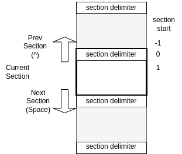

# ov - feature rich terminal pager

[](https://pkg.go.dev/github.com/noborus/ov)
[](https://github.com/noborus/ov/actions)
[](https://goreportcard.com/report/github.com/noborus/ov)

ov is a terminal pager.

* `ov` be used instead of `less` or `more` or `tail -f`.
* `ov` also has an effective function for tabular text.


<!-- vscode-markdown-toc -->
* 1. [Feature](#feature)
* 2. [Install](#install)
  * 2.1. [deb package](#deb-package)
  * 2.2. [rpm package](#rpm-package)
  * 2.3. [MacPorts (macOS)](#macports-(macos))
  * 2.4. [Homebrew(macOS or Linux)](#homebrew(macos-or-linux))
  * 2.5. [pkg (FreeBSD)](#pkg-(freebsd))
  * 2.6. [Binary](#binary)
  * 2.7. [go install](#go-install)
  * 2.8. [go get(details or developer version)](#go-get(details-or-developer-version))
  * 2.9. [Arch Linux](#arch-linux)
  * 2.10. [nix (nixOS, Linux, or macOS)](#nix)
* 3. [Usage](#usage)
  * 3.1. [Basic usage](#basic-usage)
  * 3.2. [Config](#config)
  * 3.3. [Header](#header)
  * 3.4. [Column Mode](#column-mode)
  * 3.5. [Wrap/NoWrap](#wrap/nowrap)
  * 3.6. [Alternate-Rows](#alternate-rows)
  * 3.7. [Section](#section)
  * 3.8. [Follow mode](#follow-mode)
  * 3.9. [Follow all mode](#follow-all-mode)
  * 3.10. [Follow section mode](#follow-section-mode)
  * 3.11. [Exec mode](#exec-mode)
  * 3.12. [Search](#search)
  * 3.13. [Mark](#mark)
  * 3.14. [Watch](#watch)
  * 3.15. [Mouse support](#mouse-support)
  * 3.16. [Multi Color Highlight](#multi-color-highlight)
  * 3.17. [Plain](#plain)
  * 3.18. [Jump Target](#jump-target)
* 4. [Command option](#command-option)
* 5. [Key bindings](#key-bindings)
* 6. [Customize](#customize)
  * 6.1. [Style customization](#style-customization)
  * 6.2. [Key binding customization](#key-binding-customization)

<!-- vscode-markdown-toc-config
	numbering=true
	autoSave=true
	/vscode-markdown-toc-config -->
<!-- /vscode-markdown-toc -->

##  1. <a name='feature'></a>Feature

* Supports fixed [header](#Header) line display (both wrap/nowrap).
* Supports [column mode](#ColumnMode), which recognizes columns by delimiter.
* Supports section-by-section movement, splitting [sections](#Section) by delimiter.
* Dynamic [wrap/nowrap](#WrapNoWrap) switchable.
* Supports alternating row styling.
* Shortcut keys are [customizable](#Keybindingcustomization).
* The style of the effect is [customizable](#Stylecustomization).
* Supports [follow-mode](#Followmode) (like tail -f).
* Supports [follow-section](#Followsectionmode), which is displayed when the section is updated.
* Supports following multiple files and switching when updated([follow-all](#Followallmode)).
* Supports the [execution](#Execmode) of commands that toggle both stdout and stder for display.
* Supports [watch](#Watch) mode, which reads files on a regular basis.
* Supports incremental [search](#Search) and regular expression search.
* Better support for Unicode and East Asian Width.
* Support for compressed files (gzip, bzip2, zstd, lz4, xz).
* Suitable for tabular text. [psql](https://noborus.github.io/ov/psql), [mysql](https://noborus.github.io/ov/mysql/), [etc...](https://noborus.github.io/ov/)

##  2. <a name='install'></a>Install

###  2.1. <a name='deb-package'></a>deb package

You can download the package from [releases](https://github.com/noborus/ov/releases).

```console
curl -L -O https://github.com/noborus/ov/releases/download/vx.x.x/ov_x.x.x-1_amd64.deb
sudo dpkg -i ov_x.x.x-1_amd64.deb
```

###  2.2. <a name='rpm-package'></a>rpm package

You can download the package from [releases](https://github.com/noborus/ov/releases).

```console
sudo rpm -ivh https://github.com/noborus/ov/releases/download/vx.x.x/ov_x.x.x-1_amd64.rpm
```

###  2.3. <a name='macports-(macos)'></a>MacPorts (macOS)

```console
sudo port install ov
```

###  2.4. <a name='homebrew(macos-or-linux)'></a>Homebrew(macOS or Linux)

```console
brew install noborus/tap/ov
```

###  2.5. <a name='pkg-(freebsd)'></a>pkg (FreeBSD)

```console
pkg install ov
```

###  2.6. <a name='binary'></a>Binary

You can download the binary from [releases](https://github.com/noborus/ov/releases).

```console
curl -L -O https://github.com/noborus/ov/releases/download/vx.x.x/ov_x.x.x_linux_amd64.zip
unzip ov_x.x.x_linux_amd64.zip
sudo install ov /usr/local/bin
```

###  2.7. <a name='go-install'></a>go install

It will be installed in $GOPATH/bin by the following command.

```console
go install github.com/noborus/ov@latest
```

###  2.8. <a name='go-get(details-or-developer-version)'></a>go get(details or developer version)

First of all, download only with the following command without installing it.

```console
go get -d github.com/noborus/ov
cd $GOPATH/src/github.com/noborus/ov
```

Next, to install to $GOPATH/bin, run the make install command.

```console
make install
```

Or, install it in a PATH location for other users to use
(For example, in /usr/local/bin).

```console
make
sudo install ov /usr/local/bin
```

### 2.9. <a name='arch-linux'></a>Arch Linux

You can install ov using an [AUR helper](https://wiki.archlinux.org/title/AUR_helpers).

AUR package: https://aur.archlinux.org/packages/ov-bin

### 2.10 <a name='nix'></a>nix (nixOS, Linux, or macOS)

ov is available as a nix package. You can install it with

```console
nix profile install nixpkgs#ov
```

if you use flakes, or using nix-env otherwise:

```console
nix-env -iA nixpkgs.ov
```

##  3. <a name='usage'></a>Usage

###  3.1. <a name='basic-usage'></a>Basic usage

ov supports open file name or standard input.

```console
ov filename
```

```console
cat filename|ov
```

Used by other commands by setting the environment variable **PAGER**.

```console
export PAGER=ov
```

See the [ov site](https://noborus.github.io/ov/) for more use cases.

###  3.2. <a name='config'></a>Config

You can set style and key bindings in the setting file.

Create a `.ov.yaml` file in your user's home directory.

for example.

```filepath
$HOME/.ov.yaml
```

Windows.

```filepath
%USERPROFILE%/.ov.yaml
```

Please refer to the sample [ov.yaml](https://raw.githubusercontent.com/noborus/ov/master/ov.yaml) configuration file.

If you like `less` key bindings, copy  [ov-less.yaml](https://raw.githubusercontent.com/noborus/ov/master/ov-less.yaml) and use it.

###  3.3. <a name='header'></a>Header

The `--header` (`-H`) option fixedly displays the specified number of lines.

```console
ov --header 1 README.md
```

When used with the `--skip-lines` option, it hides the number of lines specified by skip and then displays the header.

```console
ov --skip-lines 1 --header 1 README.md
```

###  3.4. <a name='column-mode'></a>Column Mode

Specify the delimiter with `--column-delimiter` and set it to `--column-mode` to highlight the column.

```console
ov --column-delimiter "," --column-mode test.csv
```

###  3.5. <a name='wrap/nowrap'></a>Wrap/NoWrap

Supports switching between wrapping and not wrapping lines.

The option is `--wrap`, specify `--wrap=false` if you do not want to wrap.
After startup, toggle display with wrap (default key `w`).

###  3.6. <a name='alternate-rows'></a>Alternate-Rows

Alternate row styles with the `--alternate-rows`(`-C`) option
The style can be set with [Style customization](#Stylecustomization).

```console
ov --alternate-rows test.csv
```

###  3.7. <a name='section'></a>Section

You specify `--section-delimiter`, you can move up and down in section units.
The start of the section can be adjusted with `--section-start`.



The section-delimiter is written in a regular expression (for example: "^#").
(Line breaks are not included in matching lines).

For example, if you specify "^diff" for a diff that contains multiple files,
you can move the diff for each file.

###  3.8. <a name='follow-mode'></a>Follow mode

Output appended data and move it to the bottom line (like `tail -f`).

```console
ov --follow-mode /var/log/syslog
```

```console
(while :; do echo random-$RANDOM; sleep 0.1; done;)|./ov  --follow-mode
```

###  3.9. <a name='follow-all-mode'></a>Follow all mode

Same as follow-mode, and switches to the last updated file when there are multiple files.

```console
ov --follow-all /var/log/nginx/access.log /var/log/nginx/error.log
```

###  3.10. <a name='follow-section-mode'></a>Follow section mode

Follow mode is line-by-line, while follow section mode is section-by-section.
Follow section mode displays the bottom section.
The following example is displayed from the header (#) at the bottom.

```console
ov --section-delimiter "^#" --follow-section README.md
```

 [Watch](#Watch) mode is a mode in which `--follow-section` and
 `--section-delimiter "^\f"` are automatically set.

###  3.11. <a name='exec-mode'></a>Exec mode

Execute the command to display stdout/stderr separately.
Arguments after (`--`) are interpreted as command arguments.

Shows the stderr screen as soon as an error occurs, when used with `--follow-all`.

```console
ov --follow-all --exec -- make
```

###  3.12. <a name='search'></a>Search

Search by forward search `/` key(default) or the backward search `?` key(defualt).
Search can be toggled between incremental search, regular expression search, and case sensitivity.
Displayed when the following are enabled in the search input prompt:

| Function | display | (Default)key |command option |
|:---------|:--------|:----|:--------------|
| Incremental search | (I) | alt+i | --incremental |
| Regular expression search | (R) | alt+r | --regexp-search  |
| Case sensitive | (Aa) | alt+c |  -i, --case-sensitive |

###  3.13. <a name='mark'></a>Mark

Mark the display position with the `m` key(default).
The mark is decorated with `StyleMarkLine` and `MarkStyleWidth`.

Marks can be erased individually with the `M` key(default).
It is also possible to delete all marks with the `ctrl + delete` key(default).

Use the `>`next and `<`previous (default) key to move to the marked position.

###  3.14. <a name='watch'></a>Watch

`ov` has a watch mode that reads the file every N seconds and adds it to the end.
When you reach EOF, add '\f' instead.
Go further to the last section.
The default is'section-delimiter', so the last loaded content is displayed.

for example.

```console
ov --watch 1 /proc/meminfo
```

###  3.15. <a name='mouse-support'></a>Mouse support

The ov makes the mouse support its control.
This can be disabled with the option `--disable-mouse`.

If mouse support is enabled, tabs and line breaks will be interpreted correctly when copying.

Copying to the clipboard uses [atotto/clipboard](https://github.com/atotto/clipboard).
For this reason, the 'xclip' or 'xsel' command is required in Linux/Unix environments.

Selecting the range with the mouse and then left-clicking will copy it to the clipboard.

Pasting in ov is done with the middle button.
In other applications, it is pasted from the clipboard (often by pressing the right-click).

###  3.16. <a name='multi-color-highlight'></a>Multi Color Highlight

This feature styles multiple words individually.
`.`key(defualt) enters multi-word input mode.
Enter multiple words (regular expressions) separated by spaces.

For example, `error info warn debug` will color errors red, info cyan, warn yellow, and debug magenta.

It can also be specified with the command line option `--multicolor`(oor `-M`).
For command line options, pass them separated by ,(comma).

For example:

```console
$ ov --multicolr "ERROR,WARN,INFO,DEBUG,not,^.{24}" access.log
```


###  3.17. <a name='plain'></a>Plain

Supports undecorating ANSI escape sequences.
The option is `--plain` (or `-p`).
After startup, toggle the original decoration (default key `ctrl+e`).

###  3.18. <a name='jump-target'></a>Jump Target

You can specify the lines to be displayed in the search results.
This function is similar to `--jump-target` of `less`.
Positive numbers are displayed downwards by the number of lines from the top(1).
Negative numbers are displayed up by the number of lines from the bottom(-1).
. (dot) can be used to specify a percentage. .5 is the middle of the screen(.5).
You can also specify a percentage, such as (50%).

This option can be specified with `--jump-target`(or `-j`).
It can be entered after startup (default key `j`).

##  4. <a name='command-option'></a>Command option

```console
$ ov --help
ov is a feature rich pager(such as more/less).
It supports various compressed files(gzip, bzip2, zstd, lz4, and xz).

Usage:
  ov [flags]

Flags:
  -C, --alternate-rows             alternately change the line color
  -i, --case-sensitive             case-sensitive in search
  -d, --column-delimiter string    column delimiter (default ",")
  -c, --column-mode                column mode
      --completion string          generate completion script [bash|zsh|fish|powershell]
      --config string              config file (default is $HOME/.ov.yaml)
      --debug                      debug mode
      --disable-mouse              disable mouse support
  -e, --exec                       exec command
  -X, --exit-write                 output the current screen when exiting
  -a, --exit-write-after int       NUM after the current lines when exiting
  -b, --exit-write-before int      NUM before the current lines when exiting
  -A, --follow-all                 follow all
  -f, --follow-mode                follow mode
      --follow-section             follow section
  -H, --header int                 number of header rows to fix
  -h, --help                       help for ov
      --help-key                   display key bind information
      --incsearch                  incremental search (default true)
  -j, --jump-target string         jump-target
  -n, --line-number                line number mode
  -p, --plain                      disable original decoration
  -F, --quit-if-one-screen         quit if the output fits on one screen
      --regexp-search              regular expression search
      --section-delimiter string   section delimiter
      --section-start int          section start position
      --skip-lines int             skip the number of lines
  -x, --tab-width int              tab stop width (default 8)
  -v, --version                    display version information
  -T, --watch int                  watch mode interval
  -w, --wrap                       wrap mode (default true)
```

It can also be changed after startup.

##  5. <a name='key-bindings'></a>Key bindings

```console
 [Escape], [q]                * quit
 [ctrl+c]                     * cancel
 [Q]                          * output screen and quit
 [ctrl+q]                     * set output screen and quit
 [ctrl+z]                     * suspend
 [h], [ctrl+alt+c], [ctrl+f1] * display help screen
 [ctrl+f2], [ctrl+alt+e]      * display log screen
 [ctrl+l]                     * screen sync
 [ctrl+f]                     * follow mode toggle
 [ctrl+a]                     * follow all mode toggle
 [ctrl+f3], [ctrl+alt+r]      * enable/disable mouse

	Moving

 [Enter], [Down], [ctrl+N]    * forward by one line
 [Up], [ctrl+p]               * backward by one line
 [Home]                       * go to top of document
 [End]                        * go to end of document
 [PageDown], [ctrl+v]         * forward by page
 [PageUp], [ctrl+b]           * backward by page
 [ctrl+d]                     * forward a half page
 [ctrl+u]                     * backward a half page
 [left]                       * scroll to left
 [right]                      * scroll to right
 [ctrl+left]                  * scroll left half screen
 [ctrl+right]                 * scroll right half screen
 [g]                          * go to line(input number)

	Move document

 []]                          * next document
 [[]                          * previous document
 [ctrl+k]                     * close current document

	Mark position

 [m]                          * mark current position
 [M]                          * remove mark current position
 [ctrl+delete]                * remove all mark
 [>]                          * move to next marked position
 [<]                          * move to previous marked position

	Search

 [/]                          * forward search mode
 [?]                          * backward search mode
 [n]                          * repeat forward search
 [N]                          * repeat backward search

	Change display

 [w], [W]                     * wrap/nowrap toggle
 [c]                          * column mode toggle
 [C]                          * alternate rows of style toggle
 [G]                          * line number toggle
 [ctrl+e]                     * original decoration toggle

	Change Display with Input

 [p], [P]                     * view mode selection
 [d]                          * column delimiter string
 [H]                          * number of header lines
 [ctrl+s]                     * number of skip lines
 [t]                          * TAB width
 [.]                          * multi color highlight

	Section

 [alt+d]                      * section delimiter regular expression
 [ctrl+F3], [alt+s]           * section start position
 [space], [ctrl+down]         * next section
 [^], [ctrl+up]               * previous section
 [9]                          * last section
 [F2]                         * follow section mode toggle

	Close and reload

 [ctrl+F9], [ctrl+alt+s]      * close file
 [ctrl+alt+l], [F5]           * reload file
 [ctrl+alt+w], [F4]           * watch mode
 [ctrl+w]                     * set watch interval

	Key binding when typing

 [alt+c]                      * case-sensitive toggle
 [alt+r]                      * regular expression search toggle
 [alt+i]                      * incremental search toggle
```

##  6. <a name='customize'></a>Customize

###  6.1. <a name='style-customization'></a>Style customization

You can customize the following items.

* StyleAlternate
* StyleHeader
* StyleOverStrike
* StyleOverLine
* StyleLineNumber
* StyleSearchHighlight
* StyleColumnHighlight
* StyleMarkLine
* StyleSectionLine
* StyleMultiColorHighlight
* StyleJumpTargetLine

Specifies the color name for the foreground and background [colors](https://pkg.go.dev/github.com/gdamore/tcell/v2#pkg-constants).
Specify bool values for Reverse, Bold, Blink, Dim, Italic, and Underline.

[Example]

```yaml
StyleAlternate:
  Background: "gray"
  Bold: true
  Underline: true
```

| item name | value | example |
|:----------|:------|:--------|
| Foreground | "color name" or "rgb" | "red" |
| Background | "color name" or "rgb" | "#2a2a2a" |
| Reverse | true/false | true |
| Bold | true/false | true |
| Blink | true/false | true |
| Dim | true/false | false |
| Italic | true/false | false |
| Underline | true/false | false |

###  6.2. <a name='key-binding-customization'></a>Key binding customization

You can customize key bindings.

[Example]

```yaml
    down:
        - "Enter"
        - "Down"
        - "ctrl+N"
    up:
        - "Up"
        - "ctrl+p"
```

See [ov.yaml](https://github.com/noborus/ov/blob/master/ov.yaml) for more information.
